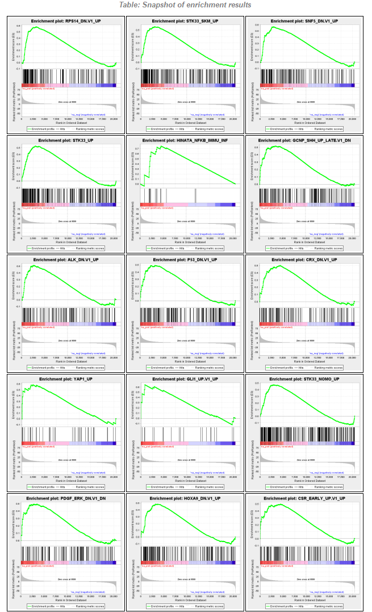
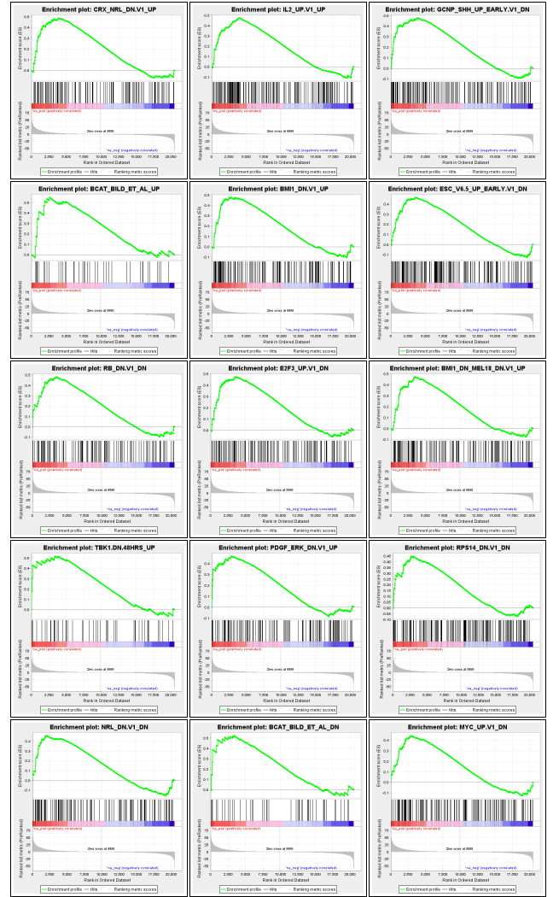
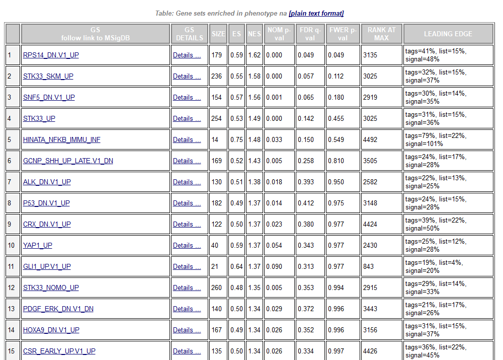
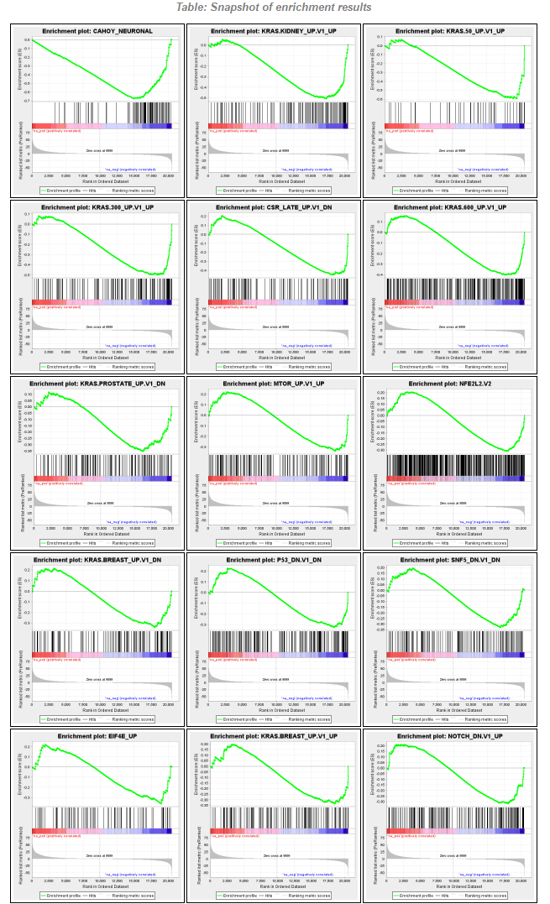
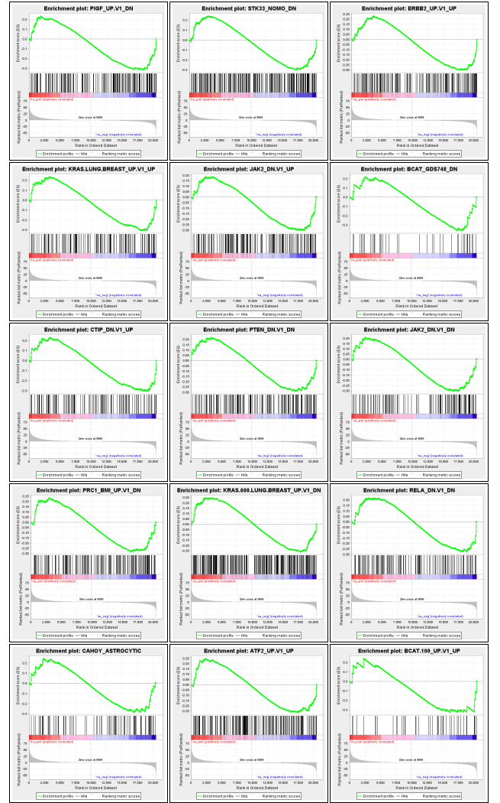
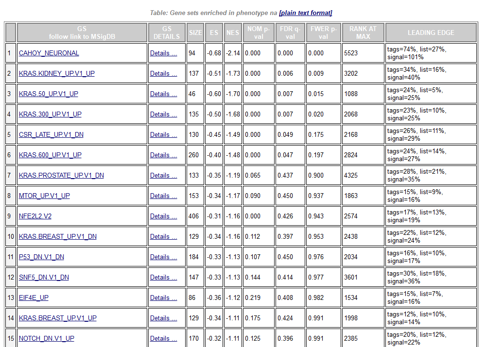

# Setup

```{r}
# Clear all objects (from the workspace)
rm(list = ls())

# Suppress Warning messages
options(warn = -1)

# Turn off scientific notation like 1e+06
# options(scipen=999)

options(stringsAsFactors = F)

# Load Libs

# # INSTALL with:
# if (!requireNamespace("BiocManager", quietly = TRUE))
#     install.packages("BiocManager")
# BiocManager::install("DESeq2")

library(limma)
library(webshot)

# Use local functions
source("./functions_enrichment.R")
```

# Directives

* Vamos a trabajar con la base de datos de Low Grade Glioma de TCGA comparando los subtipos IDHmut-codel vs IDHmut-non-codel.
* Archivos necesarios: TCGA_LGG_data_GSEA.RData, c6.all.v7.1.symbols.gmt, gsea2-2.2.4.jar y script_enrichment.R.
* Correr las instrucciones en script_enrichment.R
* Objetivo: comparar los gene sets más significativos al usar la prueba hipergeométrica y GSEA.
* Tomar en cuenta que al correr GSEA se debe de generar un directorio donde se guardan los resultados.
* Entregar un reporte en blackboard.

# Cargar datos 3 objetos: lgg_datos (datos de expresión), lgg_subtypes (clases de las muestras) y onco_gs (lista de gene sets)

```{r}
load("./TCGA_LGG_data_GSEA.RData")
```

# Limma: comparar respecto la clase IDHmut-non-codel

```{r}
aux_classes <- ifelse(lgg_subtypes == "IDHmut-non-codel", 1, 0)
lgg_limma <- limma4DS_fdr(lgg_datos, aux_classes, c("IDHmut-non-codel", "IDHmut-codel"))
```

# Obtener genes up y down regulated

```{r}
lgg_up_genes <- rownames(subset(lgg_limma, FC > 0 & q.value < 1e-06))
lgg_dw_genes <- rownames(subset(lgg_limma, FC < 0 & q.value < 1e-06))
```

# Enrichment analysis usando hipergeometrica

```{r}
lgg_up_gs <- gene_set_stats(rownames(lgg_datos), onco_gs, lgg_up_genes)
lgg_dw_gs <- gene_set_stats(rownames(lgg_datos), onco_gs, lgg_dw_genes)
```

# GSEA

## Ordenar genes por signo FC * -log10(p-value)

```{r}
lgg_limma$Cor <- sign(lgg_limma$FC) * -log10(lgg_limma$p.value)
lgg_cor <- data.frame(Gene=rownames(lgg_limma), Cor=lgg_limma$Cor)
lgg_cor <- lgg_cor[order(lgg_cor$Cor, decreasing=T),]
#Guardar en archivo de texto
write.table(lgg_cor, sep="\t", quote=F, row.names=F, col.names=F, file="LGG_subtypes.rnk")
```

## Java

```{r}
rnk_files <- dir(pattern="*.rnk")
rnk_names <- gsub(pattern=".rnk", replacement="", rnk_files)
gsea_jar <- "./gsea2-2.2.4.jar"
```

## Crear directorio

```{r}
aux_dir <- "./GSEAscores/"
aux_gmt <- "./c6.all.v7.1.symbols.gmt"
nplot <- 30
```

```{r}
for(i in 1:length(rnk_names)){
	java_command <- paste("java -cp", gsea_jar, "xtools.gsea.GseaPreranked")
	java_command <- paste(java_command, "-gmx", aux_gmt, "-collapse false -mode Max_probe -norm meandiv -nperm 1000 -rnk")
	java_command <- paste(java_command, rnk_files[i], "-scoring_scheme weighted -rpt_label", rnk_names[i], "-include_only_symbols true")
	java_command <- paste(java_command, "-make_sets true -plot_top_x", nplot, "-rnd_seed timestamp -set_max 500 -set_min 5 -zip_report false -out")
	java_command <- paste(java_command,  aux_dir, "-gui false")
	system(java_command)
}
```

# Hypergeometric Test & GSEA

## Dataset details

* The dataset has 20501 features (genes)
* No probe set => gene symbol collapsing was requested, so all 20501 features were used

## Gene set details

* Gene set size filters (min=5, max=500) resulted in filtering out 0 / 189 gene sets
* The remaining 189 gene sets were used in the analysis

## Gene markers for the na_pos versus na_neg comparison

* The dataset has 20501 features (genes)
Detailed rank ordered gene list for all features in the dataset
Global statistics and plots
Plot of p-values vs. NES
Global ES histogram

## GSEA Report for Dataset LGG_subtypes

* 157 / 189 gene sets are upregulated in phenotype na_pos
* 5 gene sets are significant at FDR < 25%
* 6 gene sets are significantly enriched at nominal pvalue < 1%
* 17 gene sets are significantly enriched at nominal pvalue < 5%

```{r}
# https://wch.github.io/webshot/articles/intro.html
# https://github.com/wch/webshot
invisible(capture.output(webshot(
  "file:///C:/Users/oskat/OneDrive%20-%20Instituto%20Tecnologico%20y%20de%20Estudios%20Superiores%20de%20Monterrey/Documents/MNT_ITESM_courses/3.3.Bioinformatica/10_GeneSetEnrichment/GSEAscores/LGG_subtypes.GseaPreranked/pos_snapshot.html",
  "./img/pos_snapshot_0.png",
  cliprect=c(30, 10, 655, 1077))))
```



```{r}
invisible(capture.output(webshot(
  "file:///C:/Users/oskat/OneDrive%20-%20Instituto%20Tecnologico%20y%20de%20Estudios%20Superiores%20de%20Monterrey/Documents/MNT_ITESM_courses/3.3.Bioinformatica/10_GeneSetEnrichment/GSEAscores/LGG_subtypes.GseaPreranked/pos_snapshot.html",
  "./img/pos_snapshot_1.png",
  cliprect=c(1106, 10, 655, 1050))))
```



```{r}
invisible(capture.output(webshot(
  "file:///C:/Users/oskat/OneDrive%20-%20Instituto%20Tecnologico%20y%20de%20Estudios%20Superiores%20de%20Monterrey/Documents/MNT_ITESM_courses/3.3.Bioinformatica/10_GeneSetEnrichment/GSEAscores/LGG_subtypes.GseaPreranked/gsea_report_for_na_pos_1590414950847.html",
  "./img/gsea_report_for_na_pos.png",
  cliprect=c(0, 0, 1000, 715))))
```



* 32 / 189 gene sets are upregulated in phenotype na_neg
* 6 gene sets are significantly enriched at FDR < 25%
* 7 gene sets are significantly enriched at nominal pvalue < 1%
* 7 gene sets are significantly enriched at nominal pvalue < 5%

```{r}
invisible(capture.output(webshot(
  "file:///C:/Users/oskat/OneDrive%20-%20Instituto%20Tecnologico%20y%20de%20Estudios%20Superiores%20de%20Monterrey/Documents/MNT_ITESM_courses/3.3.Bioinformatica/10_GeneSetEnrichment/GSEAscores/LGG_subtypes.GseaPreranked/neg_snapshot.html",
  "./img/neg_snapshot_0.png",
  cliprect=c(30, 10, 655, 1077))))
```



```{r}
invisible(capture.output(webshot(
  "file:///C:/Users/oskat/OneDrive%20-%20Instituto%20Tecnologico%20y%20de%20Estudios%20Superiores%20de%20Monterrey/Documents/MNT_ITESM_courses/3.3.Bioinformatica/10_GeneSetEnrichment/GSEAscores/LGG_subtypes.GseaPreranked/neg_snapshot.html",
  "./img/neg_snapshot_1.png",
  cliprect=c(1106, 10, 655, 1050))))
```



```{r}
invisible(capture.output(webshot(
  "file:///C:/Users/oskat/OneDrive%20-%20Instituto%20Tecnologico%20y%20de%20Estudios%20Superiores%20de%20Monterrey/Documents/MNT_ITESM_courses/3.3.Bioinformatica/10_GeneSetEnrichment/GSEAscores/LGG_subtypes.GseaPreranked/gsea_report_for_na_neg_1590414950847.html",
  "./img/gsea_report_for_na_neg.png",
  cliprect=c(0, 0, 1000, 715))))
```


