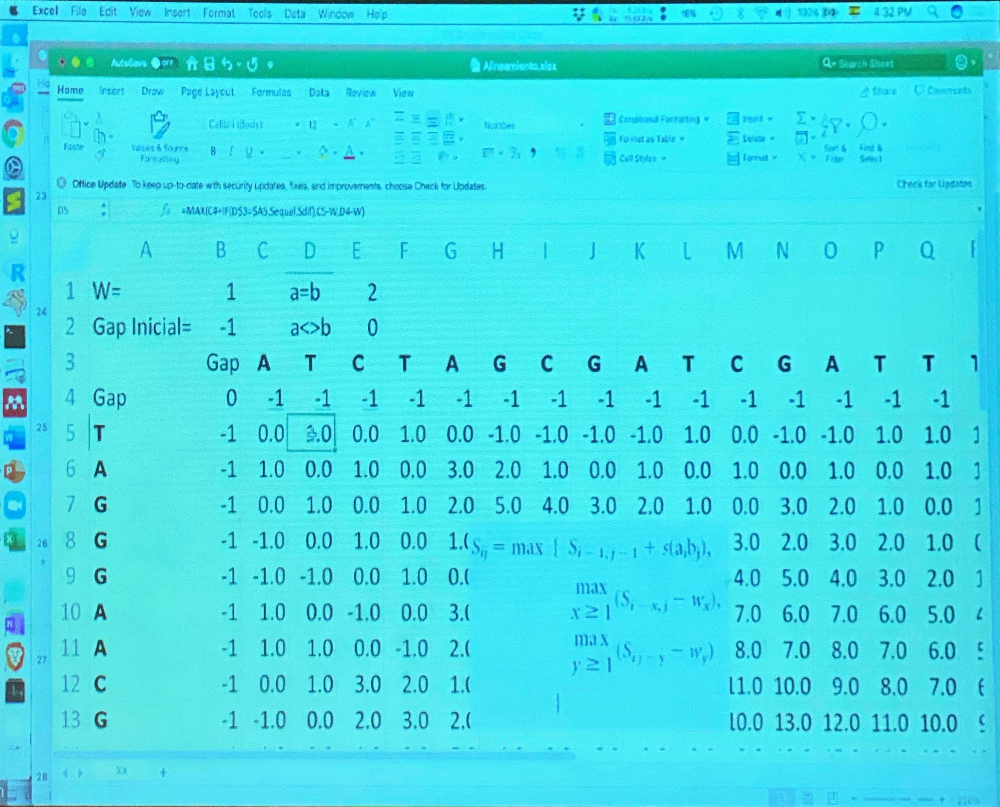
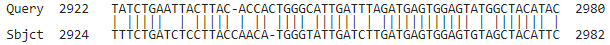

### [Antonio Osamu Katagiri Tanaka](https://www.katagiri-mx.com/about-me) - MNT16 - A01212611

```{r}
# Clear all objects (from the workspace)
rm(list = ls())
# Increase the limit for max.print in R
options(max.print=10000)
```

$$
f(\text{seqX},\text{seqY})=
\begin{array}{cc}
 \Bigg\{ & 
\begin{array}{cc}
 \text{score_match} & \text{if } \text{seqX}=\text{seqY} \\
 \text{score_mismatch} & \text{if } \text{seqX}\neq \text{seqY} \\
\end{array}
 \\
\end{array}
$$

```{r}
f <- function(seqX, seqY, score_match, score_mismatch)
{
  if (seqX == seqY)
  {
    score <- score_match
  }
  else
  {
    score <- score_mismatch
  }
  return(score)
}
```

$$
f_0 = s_{i-1, j-1} + f(\text{seqX},\text{seqY})
$$

```{r}
# Score function
f0 <- function(seqX, seqY, score_match, score_mismatch, score_global_prev)
{
  score_global_curr = score_global_prev + f(seqX, seqY, score_match, score_mismatch)
  return(score_global_curr)
}
```

$$
f_{1_x} = \underset{x \geq 1}{\max } \left\{ s_{i-1,j} - w_x \right\} \text{ & } f_{1_y} = \underset{y \geq 1}{\max } \left\{ s_{i,j-1} - w_y \right\}
$$


```{r}
# Score function if seqX (or seqY) is aligned
f1 <- function(score_global_prev, weight)
{
  score_global_curr <- score_global_prev + weight
  return(score_global_curr)
}
```

$$
f_{score} = \max
\begin{array}{cc}
 \Bigg\{ & 
\begin{array}{cc}
 f_0 \\
 f_{1_x} \\
 f_{1_y} \\
\end{array}
 \\
\end{array}
$$

```{r}
f_score <- function(seqX, seqY, score_match, score_mismatch, score_global_prev, score_global_prevX, score_global_prevY, weight)
{
  score0 = f0(seqX, seqY, score_match, score_mismatch, score_global_prev)
  score1 = f1(score_global_prevX, weight)
  score2 = f1(score_global_prevY, weight)
  score = max(c(score0, score1, score2))
  return(score)
}
```

### Let's write a function to print the alignment
```{r}
f_alignment <- function(seqx, seqy, score, score_match, score_mismatch, weights)
{
  ## Traceback
  i <- length(seqx)
  j <- length(seqy)
  ax <- character()
  ay <- character()
  
  # Add a 'dash' if a gap is required
  while (i>1 && j>1){
    sc <- score[i-1,j-1]
    sc <- f0(seqx[i], seqy[j], score_match, score_mismatch, sc)
    
    if (sc == score[i,j]) # best score is in the upper diagonal
    {
      ax <- c(seqx[i], ax)
      ay <- c(seqy[j], ay)
      i <- i-1
      j <- j-1
    }
    else if (f1(score[i,j-1], weights) == score[i,j]) # best score is up
    {
      ax <- c("-",     ax)
      ay <- c(seqy[j], ay)
      j <- j-1
    }
    else #if ((score[i-1,j] + weights) == score[i,j]) # best score is to the left
    {
      ax <- c(seqx[i], ax)
      ay <- c("-",     ay)
      i <- i-1
    }
  }
  
  # Add a 'bar' if both are equal
  seq.x <- c('',unlist(strsplit(paste(ax, collapse=''), '')))
  seq.y <- c('',unlist(strsplit(paste(ay, collapse=''), '')))
  bar = character()
  for (i in 2:length(seq.x))
  { 
    if (seq.x[i]==seq.y[i])
    {
      bar <- c(bar, '|')
    }
    else
    {
      bar <- c(bar, ' ')
    }
  }
  
  cat(paste(ax, collapse=''), "\n")
  cat(paste(bar, collapse=''), "\n")
  cat(paste(ay, collapse=''), "\n")
  return (c(ax, ay))
}
```

### Let's write a function *f_global_score* to calculate the global score using the DPM algorithm
```{r}
f_global_score <- function(Y, X, score_match, score_mismatch, weights, printTable, printAlignment)
{
  # Convert the strings into sequences (arrays) to access each letter in a loop
  # Also, contatenate an empty character at the begining of each sequence
  seq.x <- c('',unlist(strsplit(X, '')))
  seq.y <- c('',unlist(strsplit(Y, '')))
  
  # Initialize the DPM matrix
  tbl_score <- matrix(NA, length(seq.x), length(seq.y))
  
  # Add wy weights
  tbl_score[,1] <- sapply(1:length(seq.x)-1, function(x) weights)
  # Add wx weights
  tbl_score[1,] <- sapply(1:length(seq.y)-1, function(x) weights)
  # Make the top left corner eq to zero
  tbl_score[1,1] <- 0
  
  # Iterate tbl_score and do the DPM algorithm
  # NOTE: start looping from the 3rd element of the sequence as 1st is the "letter" and 2nd is the weight
  for (i in 2:length(seq.x))
  { 
    for (j in 2:length(seq.y))
    {
      tbl_score[i,j] = f_score(
        seq.x[i],            # seqX
        seq.y[j],            # seqY
        score_match,         # score_match
        score_mismatch,      # score_mismatch
        tbl_score[i-1, j-1], # score_global_prev
        tbl_score[i-1,j],    # score_global_prevX
        tbl_score[i,j-1],    # score_global_prevY
        weights)             # weight
    }
  }
  # Save table
  dimnames(tbl_score) = list(
      c('Gap', seq.x[-1]), # row names
      c('Gap', seq.y[-1])) # column names
  # Save global score
  globalScore = tbl_score[nrow(tbl_score),ncol(tbl_score)]
  
  # Print tbl_score and Global Score
  if (printTable)
  {
    print(tbl_score)
    cat("Global Score =", globalScore, '\n')
  }
  if (printAlignment)
  {
    f_alignment(seq.x, seq.y, tbl_score, score_match, score_mismatch, weights)
  }
  
  return(globalScore)
}
```

### Let's test the *f_global_score* function with the class example
```{r}
# Input parameters - aka. the 2 sequence to be aligned
Y              <- 'TAGGGAACG'
X              <- 'ATCTAGCGATCGATT'
score_match    <- 2 # my TEC ID = A01212611 -> 1+1=2 ...
score_mismatch <- 0
weights        <- -1
printTable     <- TRUE
printAlignment <- TRUE

f_global_score(X, Y, score_match, score_mismatch, weights, printTable, printAlignment)
```

{width=55%}

numbers match, so let's try a longer sequence ...
```{r}
# Input parameters - aka. the 2 sequence to be aligned
Y              <- 'TATCTGAATTACTTACACCACTGGGCATTGATTTAGATGAGTGGAGTATGGCTACATAC' #NC_045512 COVID-19
X              <- 'TTTCTGATCTCCTTACCAACATGGGTATTGATCTTGATGAGTGGAGTGTAGCTACATTC'    #NC_004718 SARS
score_match    <- 2 # my TEC ID = A01212611 -> 1+1=2 ...
score_mismatch <- 0
weights        <- -1
printTable     <- FALSE
printAlignment <- TRUE

sc_best = f_global_score(X, Y, score_match, score_mismatch, weights, printTable, printAlignment)
cat("Global Score =", sc_best, '\n')
```

{width=75%}

##### Not equal, but close to the NCBI's BLAST


#### Generate score values with shuffled sequences
```{r}
printAlignment <- FALSE

shuffled_scores = c(sc_best)
for (i in 0:2500)
{
  X_shuff = stringi::stri_rand_shuffle(X)
  Y_shuff = stringi::stri_rand_shuffle(Y)
  shuffled_scores = c(
    shuffled_scores, 
    f_global_score(X_shuff, Y_shuff, score_match, score_mismatch, weights, printTable, printAlignment))
}
```

#### Analyze the shuffled score values
```{r}
hist(shuffled_scores,
prob=TRUE, col="black", border="white", xlab="scores", breaks=25)
box(bty="l")
# Draw density function (assuming normal dist)
score_mean = mean(shuffled_scores)
score_sd   = sd(shuffled_scores)
curve(dnorm(x,mean=score_mean,sd=score_sd), add=TRUE, col="red", lwd=2)
text(score_mean, -0.002, round(score_mean,2), cex = 0.7)
text(sc_best, -0.002, round(sc_best,2), cex = 0.7)
```

### Calculating a Single p Value From a Normal Distribution
```{r}
t.test(shuffled_scores)
```

